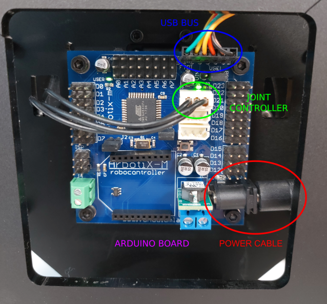
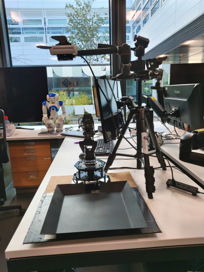
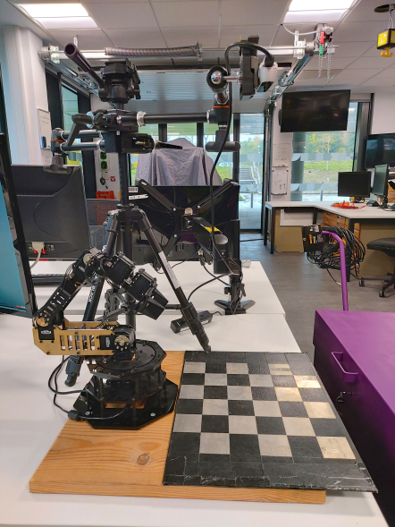
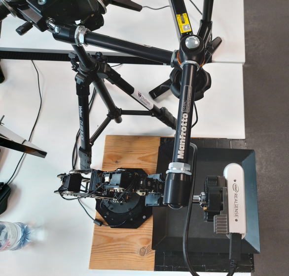
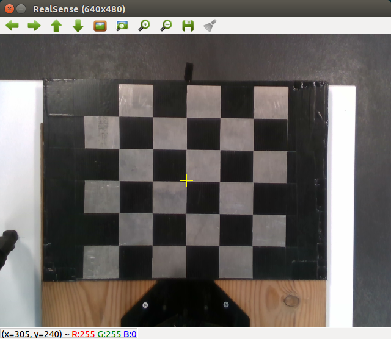

# Evaluating Gaussian Grasp Maps for Generative Grasping Models

[Link to ArXiV paper](https://arxiv.org/abs/2206.00432 "ArXiV paper link")

Parts of this code are modified from:

Generative Grasping Convolutional Neural Network (GGCNN, Morrison et al., RSS 2019) - [Paper](https://arxiv.org/abs/1804.05172) [Code](https://github.com/dougsm/ggcnn)

Generative Residual ConvNet (GRConvNet, Kumra et al., IROS 2020) - [Paper](https://arxiv.org/abs/1909.04810) [Code](https://github.com/skumra/robotic-grasping)

Orientation Attentive Robotic Grasp Synthesis with Augmented Grasp Map Representation (ORANGE, Chalvatzaki et al., IROS 2021) - [Paper](https://arxiv.org/abs/1804.05172) [Code](https://github.com/nickgkan/orange)

## Requirements:

The requirements for this repo are as follows:

* Ubuntu 16.04
* ROS Kinetic
* Python 2 (for ROS and WidowX Arm control)
* Python 3 (for PyTorch and model inference)

Specifically for the Arbotix WidowX robot arm and Intel Realsense D435
See github.com/Interbotix/widowx_arm and github.com/IntelRealSense/realsense-ros for further details

To use this repo clone it into your workspace:
```
git clone https://github.com/wtprew/grasping_robot.git
```

In order to make inferences using Pytorch and trained models, first create a virtual environment and install requirements.txt.
```
virtualenv -p python3 venv
source venv/bin/activate
pip install -r requirements.txt
```
<details>
<summary>Setting up ROS environment</summary>

Create ROS workspace
```
mkdir -p ~/ros_ws/src
cd ~/ros_ws/src
```

Clone repositories for WidowX arm ROS control:
```
git clone https://github.com/Interbotix/arbotix_ros.git
git clone https://github.com/Interbotix/widowx_arm.git
```

Clone Realsense D435 packages:
```
sudo apt-get install ros-kinetic-realsense2-camera ros-kinetic-realsense2-description
git clone https://github.com/IntelRealSense/realsense-ros.git
```

Catkin_make and install packages, then source the environment
```
cd ..
catkin_make
source ~/ros_ws/devel/setup.sh
```

You can launch the ROS realsense with the command:
```
roslaunch realsense2_camera rs_camera.launch
```
see https://github.com/IntelRealSense/realsense-ros for details

You can launch an RViz control for the WidowX arm with the command:
```
source ~/ros_ws/devel/setup.sh
roslaunch widowx_arm_bringup arm_moveit.launch sim:=false sr300:=false
```
see https://github.com/Interbotix/widowx_arm for details

This RViz controller can be used to visually control the arm by positioning the arm and using the "plan and execute" command.

</details>

***

## Arm & Demo Setup:

<details>
<summary>To set up control of WidowX arm:</summary>

Utilises Python2 and ROS



Ensure WidowX arm is turned on and camera is plugged in above the scene in the setup shown below.



1. first terminal, source ros environment (I use zsh so refer to relevant source script)

```
source ros_ws/devel/setup.zsh
```

2. launch ROS window to send commands to WidowX arm, opens RVIZ environment for GUI control
```
roslaunch widowx_arm_bringup arm_moveit.launch sim:=false sr300:=false
```

3. Future terminals use programs in the grasping_robot folder

```
cd grasping_robot
```
</details>

***

<details>
<summary>Control WidowX arm via Python commands:</summary>

Utilises Python2 environment

You can send commands directly to arm via python using the robot.py script. Opens debugging environment to send commands and can be run with other programs and used to control gripper and joints or positions although this is not necessary for demo. Useful for calibration
```
python hardware/robot.py
```

Examples of often used commands include:
```
robot.open_gripper()
robot.close_gripper()
robot.move_to_neutral()
robot.move_to_pregrasp()
```

</details>

***

<details>
<summary>Arm Calibration</summary>

Utilises Python2 environment





To calibrate arm before use, you can generate a rotation matrix from the camera POV to the robot base using the script:
```
python run_calibration.py
```

Calibration matrix is automatically saved to ~/ros_ws/intrinsics as .npy file

Calibrate by clicking on a 2D pixel coordinate in matplotlib camera window and moving arm close to corresponding pixel.
Helps if gripper is closed, e.g. robot.close_gripper() (see above for sending commands to arm via Python).
Easiest way is to use RVIZ to visually move arm.
Ideally collect greater than six corresponding points for accurate matrices.



Press "q" on camera window to close it and save calibration matrix.

This will generate a Rotation matrix which will convert any camera XYZ point into the appropriate robot's frame of reference at the base.

Saved to ~ros_ws/intrinsics/

</details>

***

## To generate example grasps using model:

Utilises Python3 and Pytorch environment

This uses Pytorch and runs in Python3 so open new terminal the source venv to run with pytorch in python3 instead of python2

Sometime it is worth unsetting the python path before sourcing python3 and runnning both can cause dependency issues (i.e. unset $PYTHONPATH).

```
source venv/bin/activate
```

Arguments:
* --description: Name of folder to save results to (string).
* --use-depth: Whether to include Dpeth image as input (Boolean).
*  --output_size: Model output size (Integer, default 320).
* --bins: Number of orientation output bins according to ORANGE (Integer, usually 1/3).
* --network: network model to load (string, 'gr'/'unet')
* --network_path: Saved network location (string).
* --use_width: Use output of model width or default to always set to maximum gripper width (flag).
* --width_scaling: If use_width set to True, scale output range by integer (integer, usually 150).
* --vis: display output (flag).

For example, GRConv model with 1 orientation bin:
```
python run_grasp_demo.py --description demo --use-depth True --output_size=320 --bins 1 --network-path grasping_robot/trained_models/GRConv_RGBD_Pos_1bin/gr_rgbd_1bin_pos.pt --width_scaling 150 --use-width --vis
```

OR Unet model with 3 orientation bins:
```
python run_grasp_demo.py --description demo --use-depth True --output_size=320 --bins 3 --network-path grasping_robot/trained_models/UNet_RGBD_Pos_3bin/unet_rgbd_3bin_pos.pt --width_scaling 150 --use-width --vis
```

## To send commands to the robot arm via model inference:

Utilises Python2 to send commands to the arm via ROS.

Open new terminal and source ROS:

```
source ~/ros_ws/devel/setup.zsh
```

Launch pick 'n' place program must be launched in a separate terminal to communicate with arm.

```
python run_pnp.py
```

Ctrl+C on grasp demo terminal to execute a grasp at a given moment.

If you use any of the work published in this paper please use the reference below:
```
@inproceedings{Prew2022,
  title={Evaluating Gaussian Grasp Maps for Generative Grasping Models},
  author={Prew, William and Breckon, Toby P and Bordewich, Magnus and Beierholm, Ulrik},
  booktitle = {Proc. IEEE International Joint Conference on Neural Networks},
  arxivId={2206.00432},
  year={2022}
}
```
